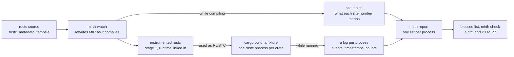

# Testing rustc's use of crate metadata with mirth

2026-10-06

## Summary

We built a rustc instrumented at the MIR level that records what every compiler process in a `cargo build` does with crate metadata. On top of it we wrote seven checkable properties of rustc's use of `.rmeta`. Seven small, plausible edits to `rustc_metadata` each broke something: **mirth caught all seven; rustc's own metadata-related tests caught three.**

The question was whether properties of how rustc writes, publishes and reads crate metadata can be written down, checked on every build, and kept current by blessing, the way UI tests keep diagnostics current. The approach: a rustc driver rewrites `rustc_metadata`'s MIR to call a small runtime at chosen sites. A build of a small Cargo workspace then produces one log per rustc process. Those logs become a reviewable list per process and are checked against the properties.

Everything here is an experiment on one pinned nightly (`nightly-2026-10-06`, rustc `ea137335b`), with one fixture and seven hand-written edits. The code is in [PowderworksCode/mirth](https://github.com/PowderworksCode/mirth) under `MIT OR Apache-2.0`.

## What was built

Five stacked PRs, all merged. Each was CI-tested on Linux, macOS and Windows; the instrumented compiler itself has only been built on Linux.

| PR | What it adds |
| --- | --- |
| [#1 Skeleton](https://github.com/PowderworksCode/mirth/pull/1) | `mirth`, a library for writing a rustc driver that Cargo accepts as a wrapper: it overrides `optimized_mir`, hands each function's MIR to a plugin, and can inject a crate the program never names. `mirth-build` sets the rpath into the sysroot. `examples/count-calls` is the smallest plugin. |
| [#2 mirth-watch and its runtime](https://github.com/PowderworksCode/mirth/pull/2) | `mirth-watch`, a plugin configured by a TOML file: it instruments frames (functions whose arguments name what happens inside them), calls (logged or counted, with captured arguments), touches of mutable statics, and crash points. `mirth-runtime` writes one log per process. Also `cargo mirth`, and tests under fat LTO. |
| [#3 The instrumented compiler](https://github.com/PowderworksCode/mirth/pull/3) | `rustc/setup.sh` and `rustc/build.sh` build stage 1 at the pinned commit through bootstrap's `RUSTC_WRAPPER_REAL` hook. `rustc/rmeta.toml` says what to record in `rustc_metadata` and `tempfile`. |
| [#4 Record, report, check](https://github.com/PowderworksCode/mirth/pull/4) | `mirth record` runs a Cargo build with that compiler; `mirth report` turns the logs into one list per process, normalized and blessable; `mirth check` checks the properties. `rustc/check.sh` runs it all on a fixture. |
| [#6 Seven edits](https://github.com/PowderworksCode/mirth/pull/6) | The seven patches in `rustc/edits/`, a runner that applies each one, rebuilds, checks, and runs rustc's own tests, and [docs/results.md](results.md) with every run's output. |

## How it works

The instrumented rustc is an ordinary stage 1 rustc whose `rustc_metadata` (and `tempfile`) were compiled by a driver that rewrites their MIR. Nothing in rustc's source changes. Two posts describe the techniques it is built on: [emavan's MIR instrumentation](https://emavan.com/blog/2025/mir-instrumentation/) and [jyn's rustc driver](https://jyn.dev/rustc-driver/).



The compiler is built once through mirth-watch; every fixture build then produces one log per rustc process, which the site tables turn into readable lists.

1. **Building the compiler.** Bootstrap runs `RUSTC_WRAPPER_REAL` as `<wrapper> <rustc> <args…>`. The wrapper is `mirth-watch`, a rustc driver. In crates the configuration names, it overrides `optimized_mir`: it takes the compiler's body, inserts calls to the runtime before each watched site, and returns the result. It writes a table of the sites it instrumented, one per crate.
2. **The runtime.** `mirth-runtime` is a std-only crate injected with `--extern force:`. Its hooks are generic Rust functions: `enter::<T>`, `argument::<T>(&T)`, `event`, `point`. The driver finds them by `#[rustc_diagnostic_item]`.
3. **Building a fixture.** `mirth record` runs `cargo build` with the instrumented rustc as `RUSTC`. When `MIRTH_OUT` is set, each rustc process writes one log. Logged events are written as they happen, with timestamps comparable across processes. Counted events are written at exit.
4. **Reporting.** `mirth report` joins the logs with the site tables. It produces one list per process, with paths, hashes and temporary names normalized. `mirth check` checks the properties across all processes.

### Where mirth follows the posts, and where it departs

| Technique | The posts | mirth |
| --- | --- | --- |
| Hooking MIR | Override `optimized_mir` via `Config::override_queries`, allocate the new body in `tcx.arena` (both) | Same |
| Driver and sysroot | `Callbacks`, an rpath from `rustc --print sysroot` in `build.rs`, a pinned nightly (jyn) | Same; the sysroot is also baked in and passed as `--sysroot`, and Windows uses `PATH` |
| Running it | A `cargo-driver` subcommand that sets `RUSTC` (jyn) | `RUSTC_WRAPPER`, `cargo mirth`, or bootstrap's `RUSTC_WRAPPER_REAL`; one binary works as all three |
| Getting the runtime in | `-L` and `--extern force:` (emavan) | Same, plus the rlib's own directory on every crate's search path: rustc finds a dependency of a dependency by searching, not through `--extern` |
| Hooks | `#[no_mangle] extern "C"` functions taking integers, kept with `#[used]`; typed references risk invalid IR under LTO (emavan) | Generic Rust functions found by diagnostic item and called by `DefId`, taking typed references. Collection keeps them. A fat-LTO test passes |
| Arguments | Integers and addresses (emavan) | Text, plain-data structs and tuples captured field by field (a `DefId` as `index:krate`), or `Debug` on request |

What neither post needed, and mirth did:

- **`-Zinline-mir=no` in instrumented crates.** Otherwise the MIR inliner replaces calls like `std::fs::rename` before the plugin sees them.
- **Requesting closures' MIR before writing the site table.** Calls inside closures were otherwise recorded but unnamed.
- **Pattern-typed integers.** rustc's `newtype_index` types now store `pattern_type!(u32 is 0..=MAX)`, which is captured by transmuting to the base type.
- **A stage 0 without `rustc-dev`.** Prebuilt `rustc_*` crates in bootstrap's stage 0 sysroot shadow the ones being built.

## What it records

For every rustc process in a build, mirth produces one list of what that process did with metadata. The list is deterministic: two clean builds give identical lists, so it can be blessed and diffed like a `.stderr` file. The `chain` fixture's blessed list is 589 lines.

[`rustc/rmeta.toml`](../rustc/rmeta.toml) chooses what is watched, in `rustc_metadata` and `tempfile` only:

| Watched | Where | Recorded as |
| --- | --- | --- |
| Every table write | `TableBuilder::set` and `set_some` (113 call sites, each a `record!`-style macro naming its table) | counted, with the item's `DefIndex` |
| Every extern query | the 116 generated `provide_extern::<query>` functions, as frames | the query and its key (`DefId` as `index:krate`, or a `CrateNum`) |
| Every table and lazy-value read | `LazyTable::get`, `LazyValue::decode`, `LazyArray::decode` | counted, attributed to the query frame it happened in, or to none |
| Dependency tracking | `tcx.ensure_ok().crate_hash(krate)` in each extern provider | counted per query and key |
| Crate loading | `CStore::register_crate` (frame, name via `Debug`) and `set_crate_data` (the `CrateNum`) | maps crate numbers to names, per process |
| File operations | the encoder's file creation and `finish`, `File::open`, `rename`, `remove_file`, `remove_dir_all`, directory creation, `link_or_copy` | logged in order, with paths and timestamps |
| Untracked state | `std::env::var*`, `std::time::*::now`, `RandomState::new`, `HashMap::new`, mutable statics | counted, with the frame they happened in |

The list for each process has five sections. Excerpts from the `chain` fixture follow, where `app` depends on `mid`, which depends on `base`.

**Files**, in order. Here is how `base` publishes its metadata: encode into a temporary directory, remove the old file, rename the new one into place, clean up.

```text
files
  create         target/debug/build/base/#/out/rmeta*     in fs::encode_and_write_metadata
  encode-to      target/debug/build/base/#/out/rmeta*/full.rmeta in encoder::encode_metadata
  encode-to      target/debug/build/base/#/out/rmeta*/stub.rmeta in encoder::encode_metadata
  remove_file    target/debug/build/base/#/out/libbase-#.rmeta in fs::encode_and_write_metadata
  rename         target/debug/build/base/#/out/rmeta*/full.rmeta -> target/debug/build/base/#/out/libbase-#.rmeta in fs::encode_and_write_metadata
  remove_dir_all target/debug/build/base/#/out/rmeta*     in -
```

**Encoded**: each table write site, with how many entries it wrote.

```text
encoded
      23    23 items  record_array!(self.tables.attributes[def_id.to_def_id()] <- attr_iter)
       9     9 items  record_array!(self.tables.fn_arg_idents[def_id] <- tcx.fn_arg_idents(def_id))
```

**Read through queries.** For each dependency and query: reads, distinct items, items whose query recorded its dependency on the crate, and how many of those entries the writer actually wrote. The last column is shown when the writer is in the same build and the query is backed by a table it encodes. Standard-library crates are summed into one `<sysroot>` row per query.

```text
      12     6 items     6 tracked    6 written  base               codegen_fn_attrs
       5     5 items     5 tracked    3 written  base               cross_crate_inlinable
       6     6 items     6 tracked    1 written  base               lookup_deprecation_entry
```

The last row says `app` asked about six of `base`'s items, and one of them, the `#[deprecated]` one, has an entry.

**Read outside a query**: reads of metadata not attributed to any extern query, such as the resolver's untracked access through `CStore`.

```text
    1300  CrateMetadata::get_span                            in -
```

**State**: environment, clock, randomness and mutable statics read in `rustc_metadata`. It is empty for the unmodified compiler.

## The properties

Seven properties are checked on every run of `rustc/check.sh`. Four are hard checks in `mirth check`. Two compare the bytes of two builds. One is a column of the blessed list, because its normal value is not "zero".

|  | Property | How it is checked | Guards against |
| --- | --- | --- | --- |
| P1 | An `.rmeta` reaches its final path only by renaming the file the encoder wrote | the final path from `--out-dir`, the crate name and `-C extra-filename`, against the logged encoder target and renames | a reader seeing a half-written file |
| P2 | No process opens an `.rmeta` before its writer renamed it into place | `File::open` timestamps in readers against `rename` timestamps in writers, across processes | races between pipelined processes |
| P3 | For each table a dependent reads, how many of the entries asked for the writer wrote | the `written` column of the list: reader keys against the writer's `set` indices | a table that stops being written, which readers see as a silent default |
| P4 | Encoding reads no environment variable, clock or random state, except what an allow list names with a reason | the state section, restricted to the `encode_metadata` frame | inputs incremental compilation cannot see |
| P5 | Two clean builds give identical `.rmeta` bytes | a second build in the same directory, `sha256` of every published `.rmeta` | nondeterminism |
| P6 | An incremental rebuild after an edit to the fixture gives the same `.rmeta` bytes as a clean build of the edited source | `fixtures/chain/edit`, then both builds in the same directory | stale results reaching the output |
| P7 | No temporary file or directory is left in the target directory | a walk of `target/` for `rmeta*` directories and `.tmp` files | leftovers |

On top of the properties, the blessed list itself is the strongest check. Any change in what a process encodes, reads, tracks, opens or renames shows up as a diff. That includes the `tracked` column, which records whether each extern query registered its dependency on the crate.

P3 is a column, not a hard check. Reading an entry the writer never wrote is normal: most items are not deprecated, so most deprecation lookups find nothing. What matters is a change in how many were written.

All builds are incremental, as Cargo's debug profile is by default. Extern queries only record their dependencies when incremental compilation is on. Builds that are compared run in the same directory, because Cargo derives a crate's identity, and so its metadata, from its path.

## Seven edits and what caught them

Each edit is a small patch to `rustc_metadata` at the pinned commit, the kind a contributor might write with a plausible reason. For each one, the instrumented compiler was rebuilt with the edit and two things were run. First, `rustc/check.sh chain`. Second, rustc's own metadata-related tests: all of `tests/incremental` (180) and the UI tests in `tests/ui/{deprecation,crate-loading,rmeta,extern,cross-crate}` (532, 6 ignored). On the unmodified compiler, P1–P7 hold, the list matches, and all those tests pass. The patches are in [`rustc/edits/`](../rustc/edits); each run's full output is in [`docs/edits/`](edits).

| # | Edit | mirth | rustc's tests |
| --- | --- | --- | --- |
| 1 | Encode the `.rmeta` straight into its final path, skipping the temporary file and the rename | P1; the list shows the rename gone | pass |
| 2 | Stop recording deprecations: the `record_some_lazy!` for `lookup_deprecation_entry` | the list: the table is no longer written | 5 deprecation UI tests fail |
| 3 | Let `RUSTC_EXTRA_FILENAME` override `extra_filename` in the crate root | P4 | pass |
| 4 | Group trait impls in a `std::collections::HashMap` instead of an `FxIndexMap` in `encode_impls` | P4, P5, P6 | pass |
| 5 | Decode every item's `def_kind` when a crate is registered | the list: 175,644 more reads per process | 10 tests hang, all of them loading a proc macro |
| 6 | Remove the `tcx.ensure_ok().crate_hash(krate)` call from extern providers | the list: every read untracked | 9 cross-crate incremental tests fail |
| 7 | Keep the metadata's temporary directory | P7 | pass |

mirth catches all seven. rustc's tests catch 2, 5 and 6, and pass 1, 3, 4 and 7.

**1. Write in place.** For each library, the encoder's target changes and the rename disappears. P1 then names it: `encoded straight to target/debug/build/base/#/out/libbase-#.rmeta`. Nothing raced in this build, so only a property of the protocol, not the outcome, sees it.

```diff
-  encode-to      target/debug/build/base/#/out/rmeta*/full.rmeta in encoder::encode_metadata
+  encode-to      target/debug/build/base/#/out/libbase-#.rmeta in encoder::encode_metadata
-  rename         target/debug/build/base/#/out/rmeta*/full.rmeta -> target/debug/build/base/#/out/libbase-#.rmeta in fs::encode_and_write_metadata
```

**2. Drop deprecations.** The writer no longer encodes the deprecated item's entry; readers still ask and silently get "not deprecated".

```diff
-       1     1 items  record_some_lazy!(self.tables.lookup_deprecation_entry[def_id] <- depr)
-       7     6 items     6 tracked    1 written  base               lookup_deprecation_entry
+       6     6 items     6 tracked               base               lookup_deprecation_entry
```

**3. An environment variable while encoding.** Two builds in the same environment produce the same bytes, so no output comparison can see this. It breaks incremental compilation the first time the variable changes.

```text
P4  base (lib)  std::env::var(RUSTC_EXTRA_FILENAME) read by encode_crate_root::{closure#33} while encoding, in encoder::encode_metadata
```

**4. A randomly seeded map.** P4 sees `HashMap::<K, V>::new` called in `encode_impls` while encoding. P5 and P6 see the consequence: impls come out in a different order in each process, so two clean builds differ.

**5. Eager decoding.** Every process now reads every dependency's `def_kind` table as it loads the crate:

```diff
+  175644  CrateMetadata::def_kind                            in CStore::register_crate
```

In the fixture that is only slow. Under rustc's tests, ten compiles hung, and every one of them loads a proc macro. The one inspected was parked in `futex_wait` with no CPU use. The fixture has no proc macro, so mirth saw the cost but not the hang. The hang was not reproduced with an uninstrumented build. The runtime is inert in those test runs, because nothing sets `MIRTH_OUT`.

**6. Untracked extern queries.** Without the `crate_hash` read, nothing tells incremental compilation that a result depends on the crate it came from. 285 rows of reads drop to zero tracked, for example:

```diff
-      16     1 items     1 tracked               base               adt_def
+      16     1 items     0 tracked               base               adt_def
```

P6 alone did not catch this: the fixture's edit did not make a stale result reach `mid`'s metadata. rustc's cross-crate incremental tests catch it because they assert what is reused (`#[rustc_clean]`, partition reuse), not what is produced.

**7. Keep the temporary directory.** The list loses each `remove_dir_all`, and P7 names what is left: `left behind: target/debug/build/base/#/out/rmeta*`.

## What the experiment taught

The first round caught five of the seven edits. Both misses were real gaps, and closing them made the tool better at its job rather than tuned to the edits.

- **Edit 3 was inside a closure.** The read sits in `stat!("final", || …)` in `encode_crate_root`. The driver asked for every function's optimized MIR before writing the site table, but not every closure's. Closures were instrumented later, during code generation, so the event was logged but could never be named. The fix requests closures' MIR too. A regression test now has a fixture that calls `std::env::var` inside a closure.
- **Edit 6 changed what rustc reuses, not what it produced here.** P6 compares an incremental rebuild's bytes with a clean build's, and they matched. rustc's cross-crate incremental tests caught it because they assert reuse directly. mirth now records the dependency itself (the `tracked` column). That only works with incremental compilation on, so recorded builds became incremental.
- **Edit 5 showed the cost of a small fixture.** mirth saw 175,644 extra reads per process; rustc's tests hit a hang mirth never could, because no fixture loads a proc macro. Recording counts says that something changed. It cannot say that a new code path deadlocks.

The edits also show where each kind of test is strong:

- **Assertions on outputs** (UI tests, P5, P6) catch a wrong answer, but not a wrong mechanism that happens to give the right answer here.
- **Assertions on reuse** (`tests/incremental`) catch dependency-tracking mistakes directly, in the specific scenarios their authors wrote.
- **A blessed record of the mechanism** catches any change in what rustc does with metadata: protocol, tables, reads, tracking. A reviewer then decides whether each change is intended.

## Limits and next steps

This shows the approach works on one fixture; it does not yet show how much it would catch in practice.

- **One fixture**: three small crates, no proc macro, no build script.
- **No `tests/run-make`.** It needs `rustdoc`. Bootstrap at this commit cannot build `rustdoc` with the pinned nightly's Cargo, because its per-crate build directories hide the compiler crates `rustdoc` links. Several run-make tests concern what edits 1 and 7 change, and might catch them.
- **The edits were written knowing what mirth watches.** They are plausible, but they are not a sample of real bugs.
- **The instrumented compiler has only been built on Linux.** mirth's own tests run on Linux, macOS and Windows.
- **One pinned nightly.** `rustc_private` changes between nightlies. Each move costs a few small fixes, recorded in `HACKING.md`.

What would make the case stronger, roughly in order:

1. **Replay real regressions.** Take past metadata and incremental bugs from rustc's history, revert their fixes on the pinned compiler, and see which ones mirth flags.
2. **More fixtures**, starting with a proc-macro crate, a build script and a dylib.
3. **Record reuse decisions** (which query results are marked green) alongside the `tracked` column, for incremental properties beyond metadata.
4. **Run `tests/run-make`**, by giving bootstrap an older Cargo layout for stage 0.

## Reproducing

On Linux, with about 30 GB free and the pinned nightly installed with `rustc-dev`:

```sh
git clone https://github.com/PowderworksCode/mirth && cd mirth
export MIRTH_RUST=$HOME/mirth-rust
rustc/setup.sh            # fetch rustc ea137335b, configure bootstrap
rustc/build.sh            # build stage 1 through mirth-watch, then std (about an hour on 16 cores)
rustc/check.sh chain      # P1-P7 and the blessed list on fixtures/chain
rustc/edits.sh chain      # each edit: rebuild, check, rustc's own tests; then restore
```

`rustc/check.sh chain --bless` accepts a changed list. To see what the plugin records in an ordinary project instead, add a `mirth.toml` and run `cargo mirth run`.
